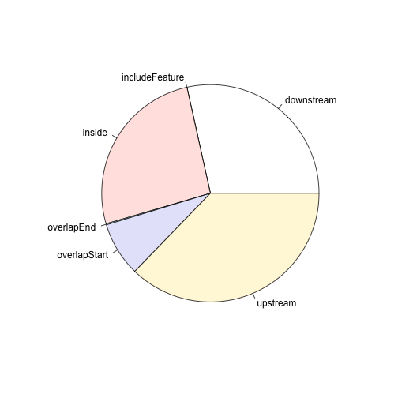
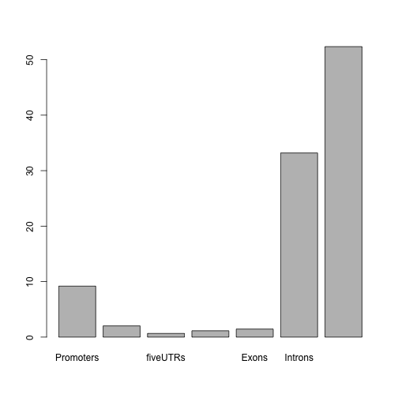

ATAC-seq tutorial
========================================================
author: Ashley S Doane
date: 11/20/2015

Setup
========================================================
## ATAC-seq Tutorial

- Data set and R code downloaded here: <http://doaneas.github.io/ATACseqCSHL/>
- Open RStudio, and open the project ***ATACseqCSHL.Rproj***
- open the file ***ATAC-CSHL/annotate.R***


Install/update Bioconductor and packages
========================================================

- Bioconductor v 3.2


```r
source("atacseqFuncitons.R")
source("https://bioconductor.org/biocLite.R")

#will install biocond if not found, and update packages
biocLite()

#if needed (biocLite will tell you)
biocLite("BiocUpgrade") 
```

========================================================
Packages

- If library not found, install with biocLite()


```r
#biocLite("org.Hs.eg.db")
#biocLite("SRAdb")
library(ChIPpeakAnno)
#biocLite("org.Hs.eg.db")
#biocLite("TxDb.Hsapiens.UCSC.hg19.knownGene")
library(org.Hs.eg.db)
library(rtracklayer)
library(TxDb.Hsapiens.UCSC.hg19.knownGene)
```
========================================================


```r
setwd("ATAC-CSHL")

##set up to read Bed 6+4 narrowPeak file as output by MACS2.1

extraCols_narrowPeak <- c(peakName = "character", DisScore = "numeric", strand="character", foldChange = "numeric",
                          neg.logPv="numeric", neglogQval= "numeric", distPeakStart= "numeric")

#import the peaks file
atacpeaks <- import.bed("LY1.chr18.narrowPeak", extraCol= extraCols_narrowPeak)
```
========================================================

## Look at the file
- what do the different coluns mean?


```r
atacpeaks
```

```
GRanges object with 2441 ranges and 6 metadata columns:
         seqnames               ranges strand   |
            <Rle>            <IRanges>  <Rle>   |
     [1]    chr18     [ 10010,  10518]      *   |
     [2]    chr18     [ 96656,  97621]      *   |
     [3]    chr18     [ 96656,  97621]      *   |
     [4]    chr18     [107890, 109944]      *   |
     [5]    chr18     [107890, 109944]      *   |
     ...      ...                  ...    ... ...
  [2437]    chr18 [77866575, 77867745]      *   |
  [2438]    chr18 [77912125, 77912524]      *   |
  [2439]    chr18 [77958081, 77958634]      *   |
  [2440]    chr18 [78015650, 78016375]      *   |
  [2441]    chr18 [78015650, 78016375]      *   |
                                                                  peakName
                                                               <character>
     [1]  /tmp/472692.3.standard.q/sample_LY1/sample_LY1.narrow_peak_29949
     [2] /tmp/472692.3.standard.q/sample_LY1/sample_LY1.narrow_peak_29950a
     [3] /tmp/472692.3.standard.q/sample_LY1/sample_LY1.narrow_peak_29950b
     [4] /tmp/472692.3.standard.q/sample_LY1/sample_LY1.narrow_peak_29951a
     [5] /tmp/472692.3.standard.q/sample_LY1/sample_LY1.narrow_peak_29951b
     ...                                                               ...
  [2437]  /tmp/472692.3.standard.q/sample_LY1/sample_LY1.narrow_peak_32220
  [2438]  /tmp/472692.3.standard.q/sample_LY1/sample_LY1.narrow_peak_32221
  [2439]  /tmp/472692.3.standard.q/sample_LY1/sample_LY1.narrow_peak_32222
  [2440] /tmp/472692.3.standard.q/sample_LY1/sample_LY1.narrow_peak_32223a
  [2441] /tmp/472692.3.standard.q/sample_LY1/sample_LY1.narrow_peak_32223b
          DisScore foldChange neg.logPv neglogQval distPeakStart
         <numeric>  <numeric> <numeric>  <numeric>     <numeric>
     [1]       497   16.78082  49.71920   46.20586           360
     [2]       557   14.51613  55.72848   52.11218           324
     [3]       100    4.83871  10.08929    7.61909           703
     [4]      4203    5.40900 420.39871  415.07846           380
     [5]       219    1.75231  21.99092   19.08807          1052
     ...       ...        ...       ...        ...           ...
  [2437]       490    9.56072  49.08502   45.58312           391
  [2438]       243    9.74843  24.33906   21.36995           166
  [2439]        75    5.04202   7.55280    5.21500           234
  [2440]       177    8.21918  17.79273   15.01934           252
  [2441]        44    3.42466   4.47880    2.38734           632
  -------
  seqinfo: 1 sequence from an unspecified genome; no seqlengths
```

========================================================

## Annootation of peaks


```r
#look at it
#what do the different columns mean?


library(TxDb.Hsapiens.UCSC.hg19.knownGene)
txdb = TxDb.Hsapiens.UCSC.hg19.knownGene
ge <- genes(txdb, columns=c("tx_name", "gene_id", "tx_type"))

anno = annotatePeakInBatch(atacpeaks, FeatureLocForDistance = "TSS",  
                                     PeakLocForDistance="middle", select = "first", 
                                     output="nearestLocation",  AnnotationData=genes(txdb))

#add gene symbols ##
anno <- addGeneIDs(anno, silence=TRUE, orgAnn="org.Hs.eg.db", feature_id_type="entrez_id", IDs2Add=c("symbol"))


annoclose <- anno[abs(anno$distancetoFeature) < 2000]

unique(na.omit(as.vector(annoclose$symbol)))
```

```
  [1] "ROCK1P1"        "USP14"          "THOC1"          "CLUL1"         
  [5] "TYMSOS"         "YES1"           "METTL4"         "SMCHD1"        
  [9] "LPIN2"          "MYL12A"         "MYL12B"         "DLGAP1-AS1"    
 [13] "LINC00667"      "ZBTB14"         "TMEM200C"       "RAB12"         
 [17] "MTCL1"          "NDUFV2"         "ANKRD12"        "TWSG1"         
 [21] "RALBP1"         "PPP4R1"         "RAB31"          "VAPA"          
 [25] "NAPG"           "GNAL"           "CHMP1B"         "MPPE1"         
 [29] "IMPA2"          "ANKRD62"        "C18orf61"       "AFG3L2"        
 [33] "PRELID3A"       "SPIRE1"         "CEP76"          "PTPN2"         
 [37] "SEH1L"          "CEP192"         "MIR4526"        "FAM210A"       
 [41] "MC5R"           "ZNF519"         "ANKRD20A5P"     "ROCK1"         
 [45] "ESCO1"          "SNRPD1"         "ABHD3"          "RBBP8"         
 [49] "CABLES1"        "TMEM241"        "RIOK3"          "C18orf8"       
 [53] "NPC1"           "CABYR"          "OSBPL1A"        "IMPACT"        
 [57] "ZNF521"         "SS18"           "PSMA8"          "TAF4B"         
 [61] "KCTD1"          "AQP4-AS1"       "DSG2-AS1"       "B4GALT6"       
 [65] "TRAPPC8"        "RNF125"         "RNF138"         "GAREM"         
 [69] "KLHL14"         "CCDC178"        "ASXL3"          "MAPRE2"        
 [73] "ZNF397"         "ZSCAN30"        "ZNF24"          "ZNF396"        
 [77] "INO80C"         "GALNT1"         "MIR3975"        "C18orf21"      
 [81] "RPRD1A"         "SLC39A6"        "MOCOS"          "TPGS2"         
 [85] "PIK3C3"         "SYT4"           "SETBP1"         "SLC14A1"       
 [89] "EPG5"           "PSTPIP2"        "HAUS1"          "C18orf25"      
 [93] "LOXHD1"         "KATNAL2"        "HDHD2"          "IER3IP1"       
 [97] "SMAD2"          "CTIF"           "SMAD7"          "DYM"           
[101] "C18orf32"       "RPL17-C18orf32" "LIPG"           "ACAA2"         
[105] "MYO5B"          "CFAP53"         "MBD1"           "CXXC1"         
[109] "SKA1"           "ME2"            "SMAD4"          "MEX3C"         
[113] "SNORA37"        "MBD2"           "POLI"           "C18orf54"      
[117] "MIR4529"        "WDR7"           "FECH"           "NARS"          
[121] "LOC100505549"   "NEDD4L"         "MALT1"          "ZNF532"        
[125] "SEC11C"         "LMAN1"          "PMAIP1"         "MC4R"          
[129] "RNF152"         "PIGN"           "TNFRSF11A"      "ZCCHC2"        
[133] "PHLPP1"         "BCL2"           "KDSR"           "VPS4B"         
[137] "SERPINB7"       "LOC284294"      "LINC01538"      "CDH19"         
[141] "TMX3"           "CD226"          "RTTN"           "SOCS6"         
[145] "CBLN2"          "FBXO15"         "CYB5A"          "CNDP2"         
[149] "LINC00909"      "ZADH2"          "TSHZ1"          "LOC100131655"  
[153] "MBP"            "ATP9B"          "NFATC1"         "CTDP1"         
[157] "PQLC1"          "HSBP1L1"        "TXNL4A"         "ADNP2"         
```

```r
pie(table(anno$insideFeature))
```

 

```r
### chromosomal regions ###

aCR<-assignChromosomeRegion(anno, nucleotideLevel=FALSE, 
                            proximal.promoter.cutoff=2000L,
                            immediate.downstream.cutoff=2000L,
                            precedence=c("Promoters", "immediateDownstream", 
                                         "fiveUTRs", "threeUTRs", 
                                         "Exons", "Introns"), TxDb=txdb)

#plot the percentages

barplot(aCR$percentage)
```

 
========================================================

## Plot the % of total peaks in each region

 

